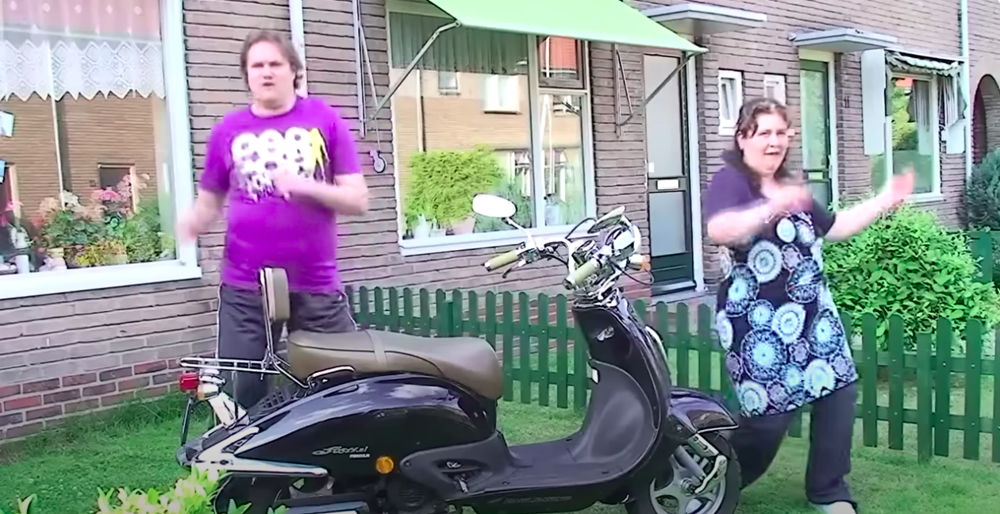

# SCOOT PROJECT

| Challenge Parameters | Challenge Details                                           |
|:---------------------|:------------------------------------------------------------|
| Repository           | `Scoot`                                               |
| Challenge type       | `Consolidation`                                             |
| Duration             | `4 days`                                                    |
| Deadline             | `12/04/2024 17h00`                                          |
| Deployment method    | `GitHub pages`                                              |
| Group composition    | `Duos`                                                      |

## Learning objectives

 - Consolidate your knowledges in GIT, HTML, CSS (SASS), JS.
 - Respect the given design and deliver pixel perfect content.
 - Work in a team.
 - Respect the given deadline.
 - Divide work in smaller parts.

 ## Mission

It's a beautiful Tuesday morning, you take a sip of your coffee while scrolling through a list of job opportunities. Suddenly, your phone rings, you don't hesitate and pick up, `Hello this is BeCode's bravest ones, how can I help you?` on other side, a piercing deep voice can be heard - `Hello, my name is Jean-Patrick Molard, I've heard that you and your team make professionally and quick websites for clients, I was hoping you could do the same for me.` 

Over the last years, Jean-Patrick has been releasing many designs for websites or applications & he succeed in his business. So much that he opened recently offices in Japan & Indonesia.
To mark the occasion, he decided to re-design his website & he would like you realize it. 
He already made the design on Figma that he will share with you. 
Your goal is to code this site, respecting the designer's mock-up, within a week. 

### The design

Here you'll find the **[FIGMA FILE](coach.md)**

Thanks to Figma, you can click and select different elements of the model and have an indication of each of them in the right column.

#### Sizes 
The different design sizes :
- Desktop: **1440 px** width
- Tablet portrait: **768 px** width
- Mobile: **375 px** width

You will have to manage the responsiveness how you think is the best.

**Advice** : Especially for the desktop, check the ["layout grid"](https://help.figma.com/hc/en-us/articles/360040450513-Create-layout-grids-with-grids-columns-and-rows) of Figma to be sure to have the correct center width. 

#### Design system
The first layout in the Figma file is the design style guide. 
You'll find all the basics informations about typo, colors, buttons effects.. here. 

#### Mobile menu
On mobile view, you'll notice there is a hamburger menu. The menu sets on the last template. 

#### Effects 
Jean-Patrick wants you to design some nice hover effects or animations as well. 
In Figma, he created the layouts with "Active" mention to show you the result of the hovers. 

There is no indication about the effects or animations. For this part, you will have to use your **creativity**.

## Instructions

Your mission is to build the front-end integration of the website. 

1. Observe the design carefully, you need to follow it strictly!
1. The website has to be responsive.
1. The website has to respond to the [w3c validator](https://validator.w3.org/).
1. Pay attention to your [SEO](https://moz.com/beginners-guide-to-seo) (The Lighthouse extension can help you).
1. You must use **Sass**. 
1. Think about some nice CSS effects/animations.
1. Make sure the site is **BUG FREE**.
1. Respect the deadline.

### For JS

1. In tablet and mobile mode, there must be a functional hamburger menu.
1. Hide the menu when scroll down in the page and display it when scroll up. [Take example on this website](https://wicky.nillia.ms/headroom.js/)

### For GitHub

1. Write a good [**README**](https://medium.com/becode/comment-faire-un-readme-sur-github-cc11f3df606a)
1. Mention a description and the website URL on the top of the repository

## Tips and Tricks

1. To help you to set up a naming convention for your classes in CSS we recommend to use the [BEM methodology](https://css-tricks.com/bem-101/).
1. Make everyday at least one **meeting**, talk about : 
    - what you did so far
    - where do you struggle
    - the objective of the day
    - plan the next meeting
1. Pull, push and merge regularly. 
1. Communicate with your partner when you push on a common branch to the repo. 
1. Be aware of your time, don't stick to an issue too long, take it in account and fix it at the end.

## Ready?

